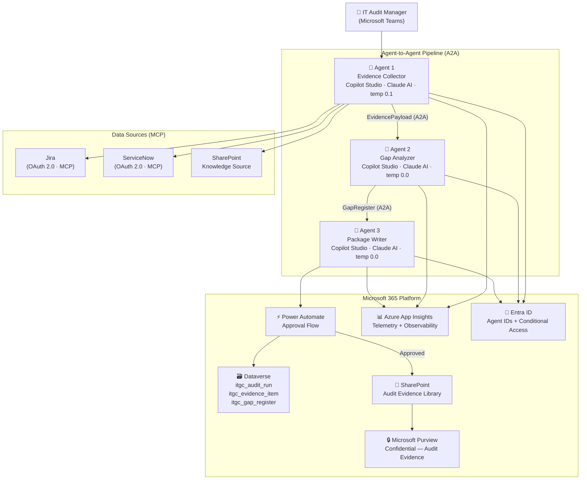

# E2 — IT Audit Readiness Agent
### Microsoft Agents League 2026 · Enterprise Agents Track

> **73% of IT audit teams spend 3+ weeks manually collecting ITGC evidence for every SOX audit cycle.**
> E2 eliminates that — three specialised AI agents, running on Microsoft 365, delivering a complete audit package in under 2 minutes.

---

## 🎬 Demo Video

https://youtu.be/zkMfMH-gbnw


---

## 🏆 Hackathon Track

| Field | Detail |
|---|---|
| **Competition** | Microsoft Agents League — AI Skills Fest 2026 |
| **Track** | Enterprise Agents |
| **Builder** | Kenneth Charumuka — CISA, MS Computer Science |
| **Submitted** | June 14, 2026 |

---

## 🔍 The Problem

IT audit teams preparing for SOX 404 audits face the same manual bottleneck every quarter:

- **Evidence collection** — manually querying Jira, ServiceNow, and SharePoint for ITGC artefacts
- **Gap identification** — manually mapping evidence to SOX 404 / PCAOB AS 2201 control requirements
- **Package preparation** — manually compiling evidence packages for auditor review

This process takes **3+ weeks per audit cycle**, introduces human error, and produces inconsistent documentation. No existing GRC tool provides automated remediation guidance alongside gap detection.

**E2 solves all three.**

---

## ✅ What E2 Does

- Connects to **Jira and ServiceNow via MCP** (OAuth 2.0) to collect ITGC evidence automatically
- Maps every evidence item to **SOX 404 / PCAOB AS 2201** control requirements
- Scores gaps by severity: **Critical → High → Medium**
- Flags **potential material weaknesses** automatically
- Generates **remediation guidance** for every gap (owner, action, deadline, evidence needed)
- Routes the audit package through a **human approval gate** before saving to SharePoint
- Saves every package with **Microsoft Purview** sensitivity labelling
- Records every audit run in **Dataverse** for full traceability

---

## 🏗️ Architecture



---

## 🤖 Agent Breakdown

### Agent 1 — Evidence Collector
- **Model:** Claude AI · temperature 0.1
- **Role:** Single entry point for all user interactions
- **Connects to:** Jira (MCP · OAuth 2.0), ServiceNow (MCP · OAuth 2.0), SharePoint (knowledge source)
- **Key behaviours:**
  - Declares scope at conversation start (identity contract)
  - Citation-first output — every evidence item carries source, record ID, timestamp, URL
  - Explicit empty-state handling — never silently returns zero results
  - Scope boundary enforced — fallback topic for all out-of-scope requests
- **Hands off:** `EvidencePayload` table → Agent 2 via A2A

### Agent 2 — Gap Analyzer
- **Model:** Claude AI · temperature 0.0
- **Role:** Maps evidence to control requirements, scores gaps, generates remediation
- **Gap conditions checked:**
  - Missing approval on change records
  - User access reviews older than 90 days
  - Segregation of Duties violations (developer = approver)
  - Missing CAB sign-off
- **Severity scoring:** Critical (SoD / missing approval on material system) · High (UAR >90 days) · Medium (documentation gaps)
- **Hands off:** `GapRegister` table → Agent 3 via A2A

### Agent 3 — Package Writer
- **Model:** Claude AI · temperature 0.0
- **Role:** Formats audit package, routes for approval, persists to SharePoint
- **Key behaviours:**
  - Posts Adaptive Card v1.6 to Teams with gap summary and action buttons
  - Triggers Power Automate approval flow — mandatory human gate
  - Writes to SharePoint **only** after approval returned `Approved`
  - Saves audit run record to Dataverse with approver and timestamp

---

## 📊 Data Architecture

### Dataverse Tables

| Table | Purpose | Key Columns |
|---|---|---|
| `itgc_audit_run` | One row per agent run | auditType, period, evidenceCount, gapCount_Critical, gapCount_High, status, approvedBy |
| `itgc_evidence_item` | One row per evidence item | source, recordId, domain, hasApprover, hasSoDFlag, citationText |
| `itgc_gap_register` | One row per gap detected | severity, controlRef, gapType, remediationOwner, remediationAction, remediationDeadline |

---

## 🔐 Security Architecture

| Control | Implementation |
|---|---|
| Identity | All 3 agents have Entra Agent IDs (auto-provisioned) |
| Authentication | Entra Conditional Access — MFA required, IT-Audit-Team group only |
| Data classification | Microsoft Purview auto-labelling — Confidential · Audit Evidence |
| Connector governance | PPAC DLP policy — only approved business connectors permitted |
| Approval gate | Power Automate — no SharePoint write without human sign-off |
| Scope boundary | Agent fallback topic — explicit decline for all out-of-scope requests |

---

## 🧰 Tech Stack

| Layer | Technology |
|---|---|
| Agent platform | Microsoft Copilot Studio |
| Agent protocol | A2A (Work IQ — GA) |
| AI model | Claude AI |
| External connectors | Jira MCP (Atlassian · OAuth 2.0), ServiceNow MCP (OAuth 2.0) |
| Approval workflow | Power Automate cloud flow |
| Data persistence | Microsoft Dataverse |
| Document storage | SharePoint Online |
| Information protection | Microsoft Purview |
| Telemetry | Azure Application Insights |
| Identity & access | Microsoft Entra ID |
| Notification | Microsoft Teams (Adaptive Cards v1.6) |

---

## 💡 Key Design Decisions

**Citation-first output** — Every evidence item carries source system, record ID, timestamp, and deep-link. In a compliance context, uncited evidence is inadmissible. This is enforced in the system prompt and verified per item before adding to `EvidencePayload`.

**Remediation alongside detection** — Every competitor (Vanta, Drata, Hyperproof, Scrut) detects gaps. None generates remediation guidance in the same workflow. E2 produces owner, action, deadline, and evidence needed for every gap — reducing the time from finding to fixing.

**Mandatory approval gate** — The agent is explicitly instructed it is "NOT authorised to save to SharePoint without human sign-off." This is architectural, not advisory — the SharePoint write action is inside the Power Automate flow and only fires on `Approved` status.

**Empty-state transparency** — Zero results from an MCP query is never silent. The agent explicitly states the source system, period queried, possible reasons, and a disclaimer that zero results is NOT confirmation controls operated effectively.

---

## 🚀 Setup Instructions

### Prerequisites
- Microsoft 365 E5 developer tenant
- Power Platform environment with Dataverse enabled
- Azure subscription (Application Insights)
- Atlassian account (Jira MCP OAuth app)
- ServiceNow instance (Personal Developer Instance available free)

### Environment Setup
1. Provision M365 E5 developer sandbox at `developer.microsoft.com/microsoft-365/dev-program`
2. Create Power Platform environment `E2-ITGC-Dev` in PPAC with Dataverse enabled
3. Create Entra security group `IT-Audit-Team`
4. Create Azure Application Insights resource `e2-itgc-insights`
5. Create SharePoint site `Audit Intelligence` with `/Audit Evidence/Policies/` folder structure

### Agent Deployment
1. In Copilot Studio, create three agents in `E2-ITGC-Dev` environment
2. Paste system prompts per agent (see `/prompts/` folder)
3. Configure Jira MCP: `https://mcp.atlassian.com/v1/sse` with OAuth scopes `read:jira-work`, `read:jira-user`, `read:audit-log:jira`
4. Configure ServiceNow MCP with tools `sn_get_record`, `sn_query_table`, `sn_get_audit_log`
5. Wire A2A: Agent 1 → Agent 2 → Agent 3
6. Create Dataverse tables: `itgc_audit_run`, `itgc_evidence_item`, `itgc_gap_register`
7. Deploy Agent 1 to Teams channel

### Trigger the Agent
In Teams, message the IT Audit Readiness Agent:
```
collect ITGC evidence for SOX Q2 FY2026
```

---

## 📈 Results

| Metric | Manual Process | E2 |
|---|---|---|
| Evidence collection time | 3+ weeks | < 2 minutes |
| Gap identification | Manual review | Automatic — SOX 404 mapped |
| Remediation guidance | Not provided | Generated per gap |
| Material weakness detection | Auditor judgement | Automatic flagging |
| Audit trail | Spreadsheet | Dataverse + SharePoint + Purview |

---


---

*Kenneth Charumuka — CISA · MS Computer Science, New York*
*Microsoft Agents League 2026 · Enterprise Agents Track*
