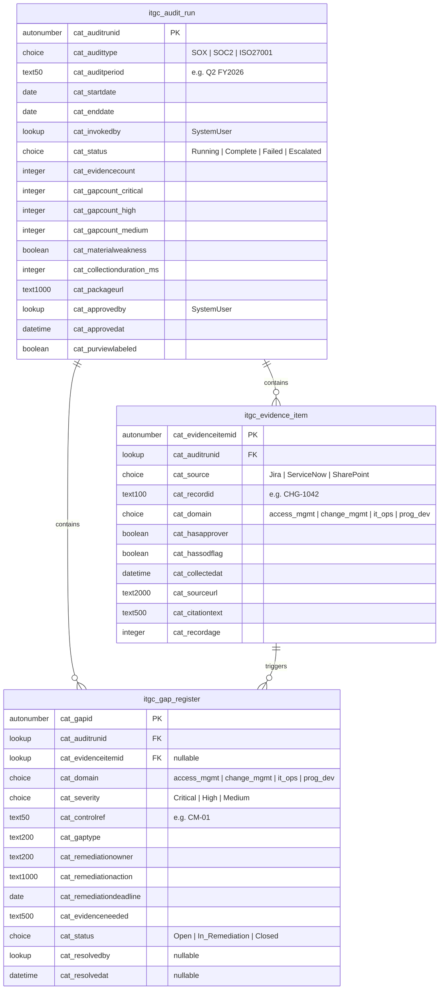

# Dataverse Schema — E2 IT Audit Readiness Agent

Three tables store the complete audit trail for every agent run.

---

## Entity Relationship Diagram

---

## Table 1 — itgc_audit_run

> One row per agent evidence collection run.

| Column | Logical Name | Type | Notes |
|---|---|---|---|
| Audit Run ID | `cat_auditrunid` | Auto Number **PK** | Auto-generated |
| Audit Type | `cat_audittype` | Choice | SOX · SOC2 · ISO27001 |
| Audit Period | `cat_auditperiod` | Text (50) | e.g. Q2 FY2026 |
| Start Date | `cat_startdate` | Date | |
| End Date | `cat_enddate` | Date | |
| Invoked By | `cat_invokedby` | Lookup → SystemUser | |
| Status | `cat_status` | Choice | Running · Complete · Failed · Escalated |
| Evidence Count | `cat_evidencecount` | Integer | |
| Critical Gaps | `cat_gapcount_critical` | Integer | |
| High Gaps | `cat_gapcount_high` | Integer | |
| Medium Gaps | `cat_gapcount_medium` | Integer | |
| Material Weakness | `cat_materialweakness` | Boolean | true if Critical cluster detected |
| Collection Duration | `cat_collectionduration_ms` | Integer | MCP query time in ms |
| Package URL | `cat_packageurl` | Text (1000) | SharePoint deep-link |
| Approved By | `cat_approvedby` | Lookup → SystemUser | Power Automate approver |
| Approved At | `cat_approvedat` | DateTime | UTC |
| Purview Labeled | `cat_purviewlabeled` | Boolean | true if sensitivity label applied |

**Indexes:** `cat_invokedby` · `cat_status` · `(cat_auditperiod, cat_audittype)` · `createdon`

---

## Table 2 — itgc_evidence_item

> One row per evidence item collected. Child of itgc_audit_run.

| Column | Logical Name | Type | Notes |
|---|---|---|---|
| Evidence Item ID | `cat_evidenceitemid` | Auto Number **PK** | |
| Audit Run | `cat_auditrunid` | Lookup **FK** → itgc_audit_run | N:1 |
| Source | `cat_source` | Choice | Jira · ServiceNow · SharePoint |
| Record ID | `cat_recordid` | Text (100) | e.g. CHG-1042, INC0012334 |
| Domain | `cat_domain` | Choice | access_mgmt · change_mgmt · it_ops · prog_dev |
| Has Approver | `cat_hasapprover` | Boolean | true if approval field populated |
| Has SoD Flag | `cat_hassodflag` | Boolean | true if submitter = approver |
| Collected At | `cat_collectedat` | DateTime | UTC |
| Source URL | `cat_sourceurl` | Text (2000) | Deep-link to source record |
| Citation Text | `cat_citationtext` | Text (500) | Formatted citation string |
| Record Age | `cat_recordage` | Integer | Days since record created |

**Indexes:** `cat_auditrunid` · `(cat_source, cat_domain)` · `cat_hassodflag` · `cat_collectedat`

---

## Table 3 — itgc_gap_register

> One row per gap identified by the Gap Analyzer. Child of itgc_audit_run.

| Column | Logical Name | Type | Notes |
|---|---|---|---|
| Gap ID | `cat_gapid` | Auto Number **PK** | |
| Audit Run | `cat_auditrunid` | Lookup **FK** → itgc_audit_run | N:1 |
| Evidence Item | `cat_evidenceitemid` | Lookup **FK** → itgc_evidence_item | Nullable |
| Domain | `cat_domain` | Choice | access_mgmt · change_mgmt · it_ops · prog_dev |
| Severity | `cat_severity` | Choice | **Critical** · **High** · **Medium** |
| Control Reference | `cat_controlref` | Text (50) | e.g. CM-01, AM-03 |
| Gap Type | `cat_gaptype` | Text (200) | One sentence description |
| Remediation Owner | `cat_remediationowner` | Text (200) | Specific role name |
| Remediation Action | `cat_remediationaction` | Text (1000) | Imperative sentence |
| Remediation Deadline | `cat_remediationdeadline` | Date | |
| Evidence Needed | `cat_evidenceneeded` | Text (500) | To close the gap |
| Status | `cat_status` | Choice | Open · In_Remediation · Closed |
| Resolved By | `cat_resolvedby` | Lookup → SystemUser | Nullable |
| Resolved At | `cat_resolvedat` | DateTime | Nullable · UTC |

**Indexes:** `cat_auditrunid` · `cat_severity` · `(cat_domain, cat_severity)` · `cat_status`

---

## Control Reference Master List

| Ref | Domain | Control |
|---|---|---|
| CM-01 | change_mgmt | All changes require documented approver |
| CM-02 | change_mgmt | Significant changes require CAB sign-off |
| CM-03 | change_mgmt | Emergency changes require retrospective approval |
| AM-01 | access_mgmt | All accounts reviewed quarterly (≤90 days) |
| AM-02 | access_mgmt | Access grants require manager approval |
| AM-03 | access_mgmt | Submitter cannot be approver (SoD) |
| IO-01 | it_ops | P1/P2 incidents require PIR within 5 business days |
| IO-02 | it_ops | Backup tested and verified within 7 days |
| PD-01 | prog_dev | Production deployments require documented sign-off |
